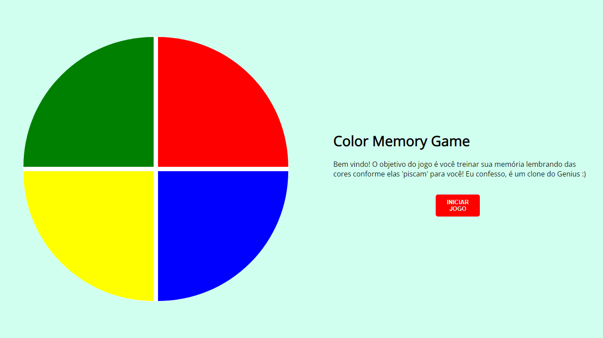

# Color Memory Game
Projeto Frontend de um referente ao bootcamp "JavaScript Game Developer" ministrado pela  [Digital Innovation One](https://www.dio.me/), com a instrutora [Gabriela Pinheiro](https://github.com/SpruceGabriela).

# Explicando o jogo
O objetivo do jogo é você treinar sua memória lembrando das cores conforme elas 'piscam' para você! 

### Atividade Original: 
https://github.com/SpruceGabriela/genesis-dio

### Agradecimento:
Gostaria também de referenciar a feature do [Marcelo Wesley](https://github.com/wesleylcarraway), que usei para solucionar alguns problemas no códigos e implementar novas ideias.

Feature: https://github.com/SpruceGabriela/genesis-dio/pull/4

### Exemplo
